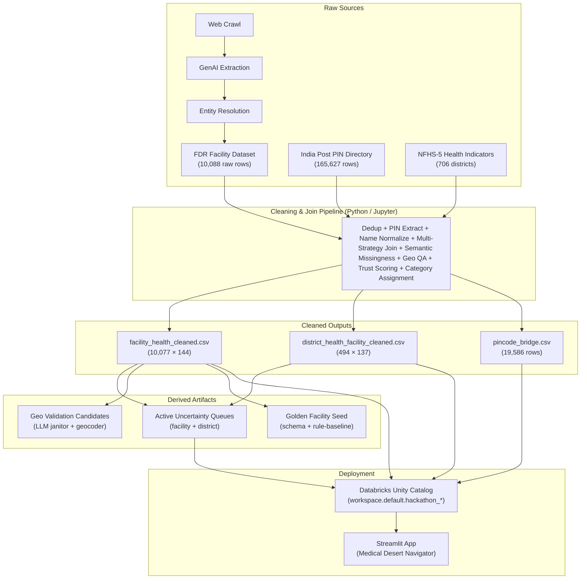
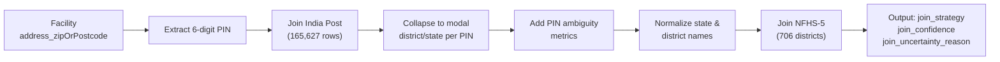
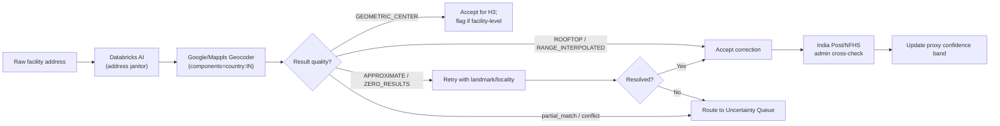
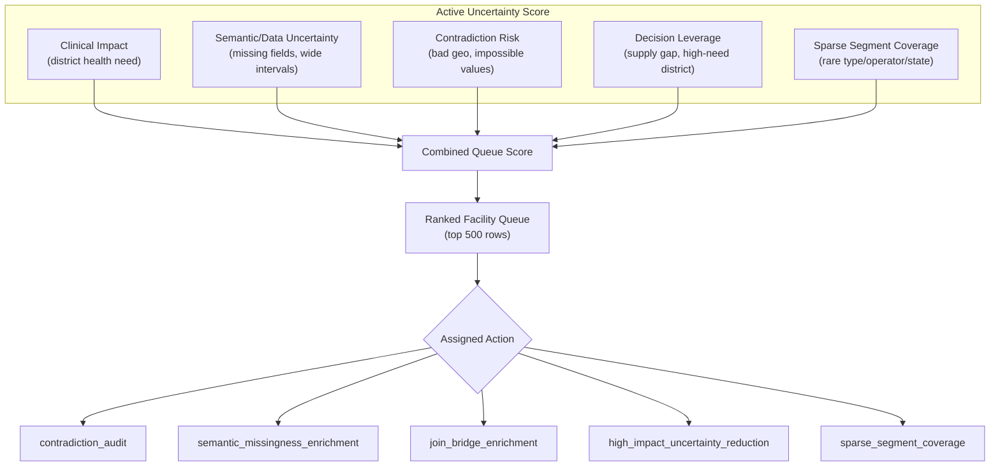
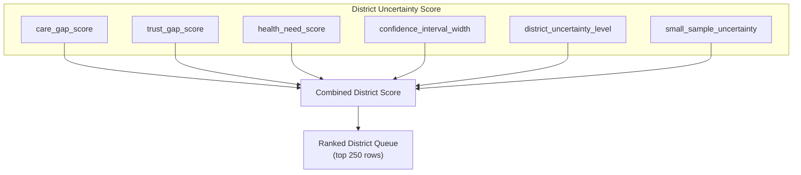
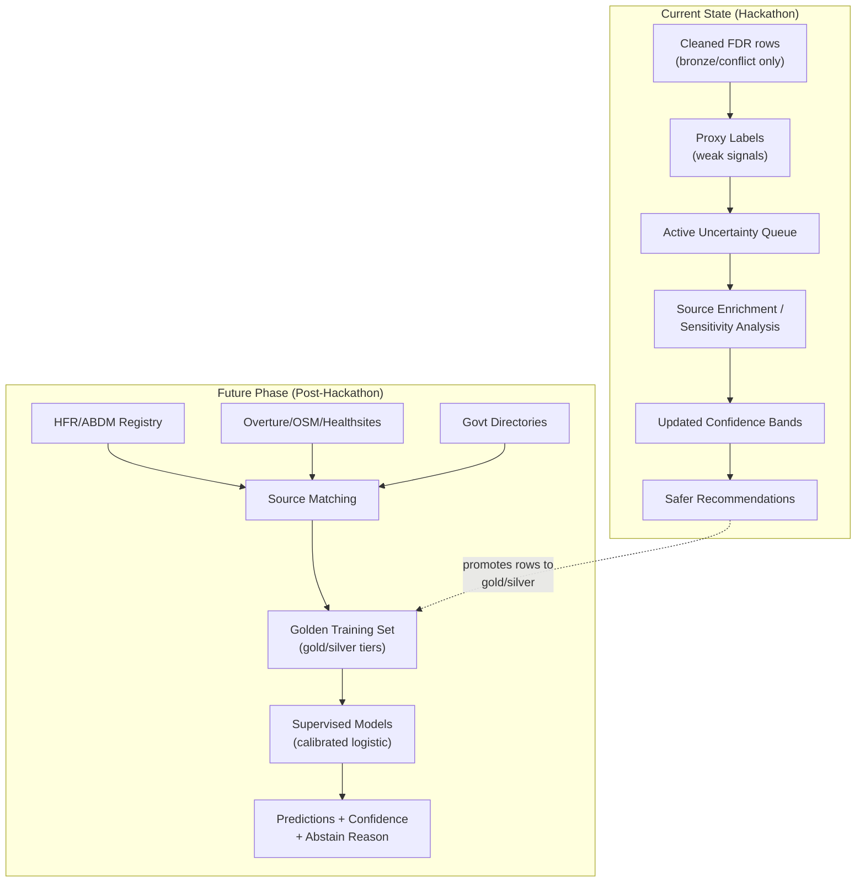
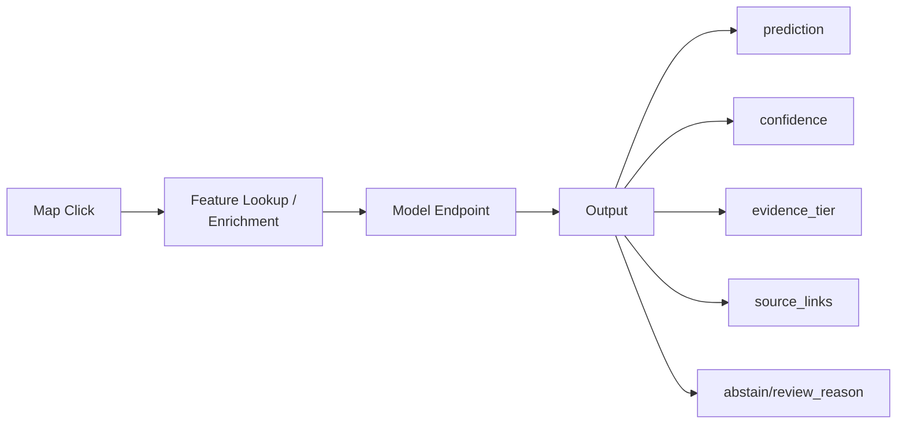
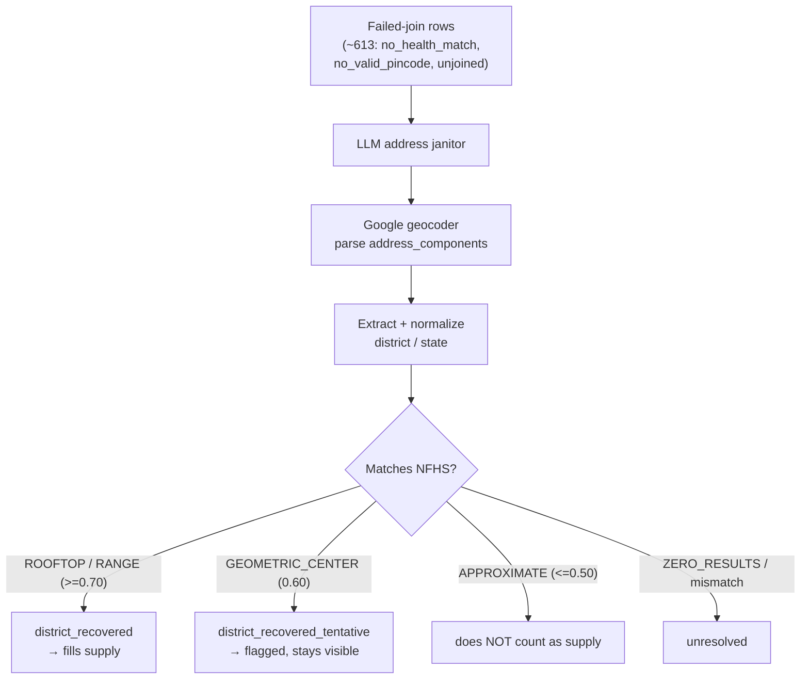

# Data Engineering

_Consolidated from all pipeline documentation, notebooks, and architecture docs._
_Last updated: 2026-06-15_

> **Companion spec:** `ZERO_SUPPLY_DESERT_RECOVERY_SPEC.md` defines a planned
> enhancement that includes all 706 NFHS districts (surfacing zero-supply
> deserts) and adds geocoder-based district recovery. Sections below marked
> **(PLANNED)** describe behavior from that spec; unmarked sections describe the
> current implemented pipeline.

---

## Table of Contents

1. [Pipeline Architecture Overview](#1-pipeline-architecture-overview)
2. [Data Source Decisions](#2-data-source-decisions)
3. [Data Cleaning & Join Strategy](#3-data-cleaning--join-strategy)
4. [Analytic Grain Decision](#4-analytic-grain-decision)
5. [Semantic Missingness Layer](#5-semantic-missingness-layer)
6. [Trust & Evidence Posture](#6-trust--evidence-posture)
7. [Geospatial Validation Strategy](#7-geospatial-validation-strategy)
8. [Statistical & Uncertainty Framework](#8-statistical--uncertainty-framework)
9. [Active Uncertainty Queues](#9-active-uncertainty-queues)
10. [Golden Facility Prediction Phase](#10-golden-facility-prediction-phase)
11. [Infrastructure & Deployment Decisions](#11-infrastructure--deployment-decisions)
12. [Zero-Supply Desert Recovery (PLANNED)](#12-zero-supply-desert-recovery-planned)
13. [Known Limitations & Risk Mitigations](#13-known-limitations--risk-mitigations)

---

## 1. Pipeline Architecture Overview

### High-Level DAG

### Decision: Batch ETL, Not Streaming

**Justification:** Sources are cached snapshots (FDR web crawl, India Post directory, NFHS-5 survey). There are no real-time data feeds. A batch pipeline with local CSV iteration is faster for hackathon development while remaining conceptually Lakeflow-ready.

---

## 2. Data Source Decisions

### Decision: Three-Table Architecture

| Table | Role | Trust Level |
|---|---|---|
| `facilities` (10,088 rows) | Web-extracted facility **claims** + provenance signals | NOT ground truth |
| `india_post_pincode_directory` (165,627 rows) | Geocoded postal directory (district/state/lat-long) | Authoritative |
| `nfhs_5_district_health_indicators` (706 rows) | District-level health need/outcomes | Authoritative (survey) |

**Justification:** The facility table is the output of a pipeline `web crawl → GenAI extraction → entity resolution`. Every step introduces uncertainty. India Post and NFHS-5 are government-published reference data and can be treated as ground truth for geography and health need respectively.

### Decision: Treat Facility Records as Claims, Not Ground Truth

**Justification:** The provenance chain means:
- Crawl coverage is incomplete (selection bias)
- LLM extraction can hallucinate or misparse
- Entity resolution can over-merge or under-merge records
- No authoritative registry has validated these facilities

**Implication:** Every facility field is a "claim" that must be cited and can be contradicted. The product surfaces this uncertainty rather than hiding it.

---

## 3. Data Cleaning & Join Strategy

### Decision: PIN-Code-Based Geographic Bridge

**Justification:** Facilities lack reliable district fields. The India Post directory provides an auditable link from PIN code to administrative geography. A direct facility→district field would be unverifiable.

### Multi-Strategy Join with Confidence Tracking

| Join Strategy | Rows | Share |
|---|---|---|
| `pincode_district_state_exact` | 9,032 | 89.6% |
| `pincode_only_no_health_match` | 397 | 3.9% |
| `facility_city_state_fallback` | 301 | 3.0% |
| `no_valid_pincode` | 150 | 1.5% |
| `pincode_district_state_fuzzy` | 131 | 1.3% |
| `unjoined` | 66 | 0.7% |

**Justification:** A single join strategy would lose ~10% of records. The cascade (exact → fuzzy → city/state fallback) maximizes coverage while tracking confidence per row via `join_strategy`, `join_confidence`, and `join_uncertainty_reason` fields.

> **(PLANNED)** A new `geocoder_district_recovery` strategy will be added after
> the cascade fails. The ~613 rows in `pincode_only_no_health_match`,
> `no_valid_pincode`, and `unjoined` are sent through the LLM + geocoder pipeline;
> the geocoder's `address_components` are parsed to recover district/state and
> re-joined to NFHS. Confidence is tiered by `location_type` (ROOFTOP/RANGE →
> 0.70, GEOMETRIC_CENTER → 0.60, APPROXIMATE → 0.50). See
> `ZERO_SUPPLY_DESERT_RECOVERY_SPEC.md` and §12.

### Decision: Name Normalization via Crosswalk

**Known traps handled:**
- NFHS `Maharastra` → India Post `MAHARASHTRA`
- `Gurgaon` ↔ `Gurugram`, `Bangalore` ↔ `Bengaluru Urban`
- `Darjiling` ↔ `Darjeeling`, `Haora` ↔ `Howrah`
- NFHS trailing whitespace in 704/706 district name rows

**Justification:** Fuzzy matching alone would miss systematic spelling differences between official datasets published in different eras. A curated crosswalk plus normalization handles the known cases deterministically.

### Decision: Deduplication by `unique_id` with Source Tracking

- 10,088 → 10,077 rows after dedup
- Preserve `source_unique_id_occurrences` and `source_duplicate_unique_id` flags

**Justification:** Deleting duplicates silently would lose provenance signal. The occurrence count is itself evidence of source coverage.

---

## 4. Analytic Grain Decision

### Decision: District as Primary Analytic Grain

**Justification:**
1. NFHS health indicators exist only at district level
2. Facility rows are noisy web-extracted claims, not a verified supply registry
3. District-level aggregation produces defensible planning signals
4. Facility-level data is retained as an audit/evidence layer

**Implication:** The district dataset (494 rows) is the app's backbone. The facility dataset (10,077 rows) provides supporting evidence for district-level conclusions.

### Known Issue: Survivorship Bias on Zero-Supply Districts

The current district table is built from the **facility side** — only NFHS districts that had at least one facility matched to them appear in the output. This drops the ~212 NFHS districts (706 → 494) that had zero matched facilities.

This is a critical gap for medical-desert analysis: a district with zero observed supply is the **strongest possible desert signal**, yet it is currently excluded. The absence has three competing explanations (real desert / crawl gap / join failure) that the current pipeline cannot distinguish.

> **(PLANNED)** §12 and `ZERO_SUPPLY_DESERT_RECOVERY_SPEC.md` describe the fix:
> rebuild the district table from the **NFHS side** (all 706 districts), annotate
> zero-supply districts explicitly, rank them as highest priority, and use
> geocoder-based district recovery to separate real deserts from join failures.

---

## 5. Semantic Missingness Layer

### Decision: Detect and Flag Semantic Missingness

**Trigger:** Databricks/Gemini feedback identified that many facility fields *look* populated but hold meaningless values (`"null"`, empty JSON arrays, blank strings, no-evidence phrases, unparseable dates).

### Coverage After Semantic Cleaning

| Field | Semantically Valid | Missing/Invalid | Estimated |
|---|---|---|---|
| `capacity` (beds) | 24.9% | 75.1% | 7,566 rows |
| `numberDoctors` | 36.0% | 64.0% | 6,450 rows |
| `yearEstablished` | 47.3% | 52.7% | — |
| `recency_of_page_update` | 35.0% | 65.0% | — |
| `equipment` | 70.5% | 29.5% | — |

**Justification:** Raw field completeness was misleading. Without semantic validation, the pipeline would treat `"null"` strings as data, producing garbage aggregations and hiding the true uncertainty.

### Decision: Estimate with Intervals, Never Launder into Facts

- Capacity and doctor counts imputed via facility-type/operator/state peer-group cohort medians
- Intervals exposed: `capacity_estimate_interval_low/high`, `doctor_count_estimate_interval_low/high`
- Status fields: `capacity_status`, `capacity_confidence`, `capacity_is_estimated`
- UI must display "estimated" label when `*_is_estimated = true`

**Justification:** Point estimates without intervals would give false precision. The interval approach (empirical p10-p90) communicates planning ranges honestly.

---

## 6. Trust & Evidence Posture

### Decision: 3-State Evidence Classification (Not Binary)

| State | Meaning |
|---|---|
| `passed_checks` | Strong join, plausible geo, source URLs, claim fields, no extreme outliers |
| `needs_review` | Low confidence, weak evidence, suspicious geography, or extreme fields |
| `contradicted_or_geo_invalid` | Geography impossible, internal contradictions, or extreme outliers |

**Justification:** A binary verified/unverified model would collapse "unknown" into "false," creating selection bias. Real deserts would be inflated by phantom facilities counted as absent. The 3-state model preserves the "we don't know" category.

### Decision: Never Use the Word "Verified"

**Justification:** Without human-verified labels or authoritative registry matches, no record has been verified. The labels are evidence postures, not truth claims.

### Decision: Outlier Flagging Rather Than Deletion

- `numberDoctors` max = 15,000 → flagged, not removed
- `capacity` max = 4,000 → flagged, not removed

**Justification:** Extreme values are likely extraction errors, but deleting them loses the underlying signal. The pipeline caps/winsorizes for aggregation but preserves originals with flags for auditability. Downstream consumers see `capacity_num_extreme_outlier = true`.

### Decision: Source-Tiered Evidence Framework

| Tier | Sources | Use |
|---|---|---|
| A | ABDM HFR, PM-JAY, India Post/data.gov.in | Authoritative existence/identity/geography |
| B | Overture Maps, OSM/Healthsites, National Health Portal | Open-data corroboration |
| C | geoBoundaries, HMIS/NHSRC, NFHS-5, facility websites/source URLs | Context and citation |
| D | Google Maps/Mappls | Runtime validation only (license-restricted) |

**Justification:** Not all external data is equally trustworthy. Tiering prevents treating a geocoder hit as equivalent to an authoritative registry match.

---

## 7. Geospatial Validation Strategy

### Decision: LLM + Geocoder Pipeline (Not Manual Labeling)

**Justification:** Manual labeling of 10,000+ facilities is infeasible in a hackathon. The LLM parses messy Indian address text into structured JSON; the geocoder validates physical existence. This produces actionable uncertainty signals without requiring human labels.

### Geo Quality Classification

| Geo Class | Rows | Share | Action |
|---|---|---|---|
| Plausible | 7,861 | 78.0% | Usable as-is |
| Moderate distance from PIN centroid | 1,164 | 11.6% | Validate if operationally important |
| Far from PIN centroid | 928 | 9.2% | High-priority correction queue |
| Missing coordinates | 118 | 1.2% | Need geocode or registry match |
| Outside India bounding box | 6 | 0.06% | Demo-grade failure; fix immediately |

### Decision: Geocoder Results Are Uncertainty Reducers, Not Truth Oracles

| Geocoder Result | Action |
|---|---|
| `ROOFTOP` | Accept as high-quality correction |
| `RANGE_INTERPOLATED` | Accept unless it crosses district/PIN boundary |
| `GEOMETRIC_CENTER` | Accept for H3/neighborhood analysis; flag for facility-level precision |
| `APPROXIMATE` | Retry with landmark/locality; otherwise route to uncertainty queue |
| `ZERO_RESULTS` | Search HFR/PM-JAY/Mappls; otherwise uncertainty queue |
| `partial_match=true` | Medium quality; route high-impact rows to uncertainty queue |

**Justification:** Google's own documentation states that a precise geocoder location does not prove an address exists. A geocoder hit narrows the uncertainty band only when provider metadata, admin geography, PIN, and facility name all agree.

### Decision: No Full Lakeflow/DLT Deployment for Hackathon

**Justification:** The fuzzy-match techniques are worth using now, but provisioning a full Lakeflow pipeline adds overhead without payoff for a batch snapshot. A SQL template (`lakeflow_geo_validation_pipeline.sql`) is kept ready for production scheduled refresh.

---

## 8. Statistical & Uncertainty Framework

### Decision: No Supervised Accuracy Claims Without Gold Labels

**Justification:** Without human-verified labels, proxy trust scores cannot claim measured accuracy (no Brier score, ECE, or calibrated reliability). The pipeline uses:
- Confidence intervals
- Prediction intervals
- Informative missingness
- Active uncertainty ranking
- Sensitivity analysis

### Decision: Wilson Intervals for District Rates

**Justification:** District rates (trustworthy supply rate, needs-review rate, etc.) are based on finite observed facility rows. Wilson intervals properly handle small samples and bounded proportions.

### Decision: Empirical p10-p90 for Numeric Estimates

**Justification:** Missing capacity/doctors need planning ranges from peer-group cohorts, not point estimates. The empirical interval communicates the full range of plausible values without Gaussian assumptions.

### Decision: No Gaussian Assumptions

**Justification:** All operational fields are heavy-tailed with implausible maxima:
- `capacity` (beds): skew 4.1, max 4,000, closer to log-normal
- `numberDoctors`: skew 36, max 15,000, extreme outliers
- `followers`: skew 54, max 15,000,000

**Approach:** Use medians, quantiles, ranks, robust caps, log-scale views, and Wilson intervals instead of means and z-scores.

### Decision: Informative Missingness as a Feature, Not a Gap

**Justification:** Missing capacity/doctors/equipment is correlated with facility type, operator type, state, source type, and recency. It is likely MNAR (informative), not MCAR. Stronger or more digitally mature facilities publish more details. The missingness pattern itself signals source quality.

### Decision: Hierarchical Shrinkage for Estimates

**Justification:** Many facility/operator/state segments are small. The pipeline estimates from narrow cohorts when supported (e.g., "hospital + private + same state"), then broader cohorts, then global fallback. Never trusts tiny raw cell means.

---

## 9. Active Uncertainty Queues

### Decision: Active Uncertainty Instead of Active Learning

**Justification:** Classical active learning assumes a human oracle available to label queried examples. This project has no oracle. The queues answer: "Where would one more piece of evidence most reduce decision uncertainty?" rather than "Which example should a human label next?"

### Facility Queue Scoring

Signals: high district health need, estimated/missing capacity and doctors, wide prediction intervals, critical supply gaps, low join confidence, non-plausible geography, ambiguous pincode, missing source URLs, missing contact evidence, rare segments.

### District Queue Scoring

### Queue Actions

| Action | Meaning |
|---|---|
| `contradiction_audit` | Geography or internal contradictions make the row risky |
| `semantic_missingness_enrichment` | Critical operational fields are missing or estimated |
| `join_bridge_enrichment` | PIN/district/state mapping uncertainty drives the risk |
| `high_impact_uncertainty_reduction` | High health need + fragile facility evidence |
| `sparse_segment_coverage` | Row is from a thin segment where assumptions are weak |
| `stress_test_desert_call` | District recommendation rests on thin evidence |
| `rate_ci_reduction` | Rate intervals are wide due to small observed samples |

---

## 10. Golden Facility Prediction Phase

### Decision: Defer Supervised Learning Until Source-Corroborated Labels Exist

**Justification:** Current seed data is all bronze/conflict tier. No gold or silver labels exist yet. Training a supervised model on weak/proxy labels would learn the current rules (circularity), not facility truth.

### Label Policy

| Tier | Definition | Model Use |
|---|---|---|
| `gold` | Tier A registry match + consistent admin geography, or multiple Tier B/C sources agreeing | Train and evaluate |
| `silver` | Strong open-source agreement, no authoritative registry match | Train with lower weight or validate separately |
| `bronze` | FDR-only or weak/fuzzy corroboration | Active learning only, not final training |
| `conflict` | Sources disagree on identity/district/PIN/type/location | Exclude from training; route to review |

### Decision: Calibrated Logistic Regression as Baseline

**Justification:** Defensible baseline for small source-corroborated tabular labels. Produces probabilities for abstention thresholds. Compare against LightGBM/CatBoost only after enough gold/silver labels exist per task.

### Decision: Abstention Over False Confidence

**Justification:** In sparse or conflicting regions, a confident prediction is more dangerous than no prediction. The model contract is:

### Decision: Google/Mappls Not Used as Durable Training Labels

**Justification:** Geocoding API terms of service may restrict durable storage for model training. Google/Mappls results are used for runtime uncertainty reduction but not promoted to training labels without explicit license review.

---

## 11. Infrastructure & Deployment Decisions

### Decision: Dual-Backend Architecture

| Mode | Data Source | Use Case |
|---|---|---|
| `DATA_BACKEND=csv` | Local `output/data/*.csv` files | Fast local development |
| `DATA_BACKEND=warehouse` | Unity Catalog `workspace.default.hackathon_*` tables | Deployed Databricks App |

**Justification:** Same column contract either way. Developers iterate locally on CSVs; deployed app reads from Delta tables via SQL warehouse. No code branching except the data-loading function.

### Decision: Streamlit on Databricks Free Edition

**Justification:** Fastest path to a non-technical UI with persistence. Streamlit supports pydeck (deck.gl) maps, H3 hex layers, interactive widgets, and Delta persistence — all required for the product spec.

### Decision: pydeck H3HexagonLayer for Maps

**Justification:** Same primitive VF Match uses. H3 hexagons provide uniform-area spatial binning without the visual distortion of lat/lon grids. The `h3` Python library handles all binning logic.

### Decision: Unity Catalog as Single Source of Truth

**Tables created:**
- `workspace.default.hackathon_facility_health_cleaned` (10,077 rows)
- `workspace.default.hackathon_district_health_facility_cleaned` (494 rows)
- `workspace.default.hackathon_pincode_bridge` (19,586 rows)
- `workspace.default.hackathon_district_unmatched_pincode_facility_counts` (60 rows)

**Planned tables:**
- `workspace.default.active_learning_facility_queue`
- `workspace.default.active_learning_district_queue`
- `workspace.default.golden_facility_training_set`
- `workspace.default.facility_prediction_features`
- `workspace.default.facility_prediction_outputs`

**Justification:** A single schema (`workspace.default.hackathon_*`) avoids confusion from earlier duplicate schemas and ensures the app has one canonical data source.

### Decision: Foundation Model API for LLM Tasks

- Used: `databricks-gemini-3-5-flash` for address parsing
- Available: `databricks-meta-llama-3-3-70b-instruct`, `databricks-gpt-oss-20b/120b`

**Justification:** Databricks-hosted models avoid external API costs/latency and keep data within the platform governance boundary.

---

## 12. Zero-Supply Desert Recovery (PLANNED)

_Full spec: `ZERO_SUPPLY_DESERT_RECOVERY_SPEC.md`._

### Problem

The district table is built from matched facilities only, so the ~212 NFHS
districts with zero matched facilities (706 → 494) are dropped. These are the
highest-signal candidate deserts — residents may have no access to any clinical
facility — yet they are invisible in the leaderboard. This is survivorship bias.

### Decision: Build the District Table from the NFHS Side (all 706 districts)

Flip the aggregation so every NFHS district appears via a LEFT JOIN from the NFHS
side. Zero-supply districts get `observed_facility_rows = 0`, `zero_observed_supply = true`,
and `district_uncertainty_level = "higher"` (absence has three explanations).

### Decision: Geocoder-Based District Recovery

**Two-tier acceptance (asymmetric-harm conservative):** falsely erasing a real
desert is higher-harm than falsely keeping one, so only ≥0.70 recoveries remove a
district from the zero-supply state. GEOMETRIC_CENTER (0.60) is tentative and stays
flagged; APPROXIMATE (≤0.50) never erases a desert.

### Decision: Three Terminal States for Zero-Supply Districts

| Category | Meaning | Desert confidence |
|---|---|---|
| `zero_observed_supply_unvalidated` | Zero supply, no geocoding evidence either way | Lowest — blind spot |
| `zero_supply_geocode_checked` | Geocoding attempted on nearby rows, none confirmed | **Higher** — actively checked |
| (recovered) → leaves zero-supply | Geocoding found a real facility (≥0.70) | Not a desert |

Both zero-supply categories rank **above** `real_desert_candidate`, because complete
observed absence is a stronger signal than low-but-nonzero supply. Geocoding either
fills a gap or **hardens** the desert signal.

### Decision: Separate Leaderboard Lane (Not Interleaved)

Zero-supply districts render in a distinct lane above the evidenced care-gap lane,
never interleaved by `health_need_score`. The two have different epistemic status
and are not comparable on a single need axis. Within the zero-supply lane,
`zero_supply_geocode_checked` ranks above `zero_observed_supply_unvalidated`.

### Optional Extensions

- **Full-coverage geocoding:** a `--full-coverage` flag geocodes all eligible rows
  (not just the priority list), with query deduplication for cost control.
- **WorldPop population weighting (Phase 2):** weight zero-supply deserts by
  affected population via WorldPop raster + geoBoundaries zonal statistics. Different
  geospatial dependency footprint; the core feature ships independently.

---

## 13. Known Limitations & Risk Mitigations

### Acknowledged Gaps

| Gap | Impact | Mitigation |
|---|---|---|
| Zero-supply districts dropped (706 → 494) | Strongest desert candidates excluded (survivorship bias) | **(PLANNED §12)** Rebuild from NFHS side; include all 706 with zero-supply annotation |
| No population denominator | Cannot compute per-capita access | Proxy with density framing; **(PLANNED, optional §12)** WorldPop weighting |
| No travel-time accessibility | Cannot compute isochrones | Approximate with haversine distance to nearest trustworthy facility |
| NFHS older than facility data | District context may lag reality | Label as "district context, not facility fact" |
| No human-verified label set | Cannot claim measured accuracy | Use proxy CIs, sensitivity analysis, active queues |
| District grain only for health | Cannot attribute need to sub-district | Preserve `district_uncertainty_level`; never make facility-level claims from district data |
| Sparse operational fields (25-48%) | Cannot rank on capacity/doctors alone | Lean on need + trustworthy supply + service signals |
| 6 outside-India coordinates | "Ocean hospital" class | Demo proof of why verification matters |

### Intuit Playbook Principles Applied

1. **Impossible to penalize across full surface** — checklist against all judging criteria
2. **Confidence intervals are the product, not garnish** — shown in every district view
3. **Separate evidence types** — source corroboration vs internal plausibility vs estimates
4. **Selection bias: unverified ≠ false** — 3-state verdict everywhere
5. **Demo as model-risk defense** — lead with the failure you catch (ocean hospital)
6. **Fast fallback** — heuristic map works before the predictive engine
7. **Freeze rule** — stop adding once it demos cleanly; polish the narrative

---

## Summary of Outputs

| Output | Grain | Purpose |
|---|---|---|
| `facility_health_cleaned.csv` | Per facility | Evidence layer with trust signals |
| `district_health_facility_cleaned.csv` | Per district | App backbone with scores and categories |
| `pincode_bridge.csv` | Per PIN code | Geographic join bridge |
| `active_learning_facility_queue.csv` | Per facility | Uncertainty triage |
| `active_learning_district_queue.csv` | Per district | Recommendation fragility |
| `geo_validation_candidates.csv` | Per facility | Geocoder pipeline candidates |
| `geocoder_uncertainty_priors.csv` | Per geocoder status | Transparent geo priors |
| `golden_facility_training_set_seed.csv` | Per facility | Schema seed for supervised phase |
| `facility_prediction_outputs_seed.csv` | Per facility | Rule-baseline predictions |
| `cleaned_dataset_audit.json` | Pipeline-level | Validation report |
| `actual_insights_summary.json` | Pre-computed | Top care gaps, rankings |

---

## Planning Category Distribution

### Current (494 districts — matched supply only)

| Category | Districts | Meaning |
|---|---|---|
| `real_desert_candidate` | 8 | Genuine unmet need → deploy/help |
| `phantom_desert_or_verification_gap` | 15 | Unverified → verify first |
| `supply_record_quality_problem` | 93 | Records broken → fix |
| `referral_or_capacity_candidate` | 99 | Capacity exists → refer |
| `mixed_or_monitor` | 279 | Monitor |

### Planned (all 706 districts — adds zero-supply categories)

| Category | Meaning | Priority |
|---|---|---|
| `zero_supply_geocode_checked` | Zero supply, geocoding attempted, none confirmed | Highest (hardened desert) |
| `zero_observed_supply_unvalidated` | Zero supply, no geocoding evidence | Highest (blind spot) |
| `real_desert_candidate` | Genuine unmet need → deploy/help | High |
| `phantom_desert_or_verification_gap` | Unverified → verify first | Medium |
| `supply_record_quality_problem` | Records broken → fix | Medium |
| `referral_or_capacity_candidate` | Capacity exists → refer | Lower |
| `mixed_or_monitor` | Monitor | Lowest |

The ~212 newly-included zero-supply districts are split between the two zero-supply
categories depending on whether geocoder recovery was attempted (see §12).
