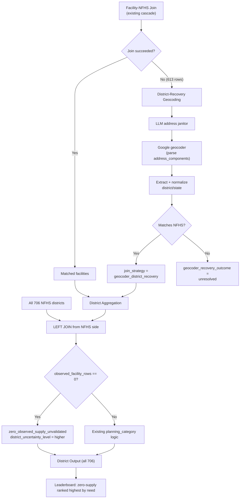
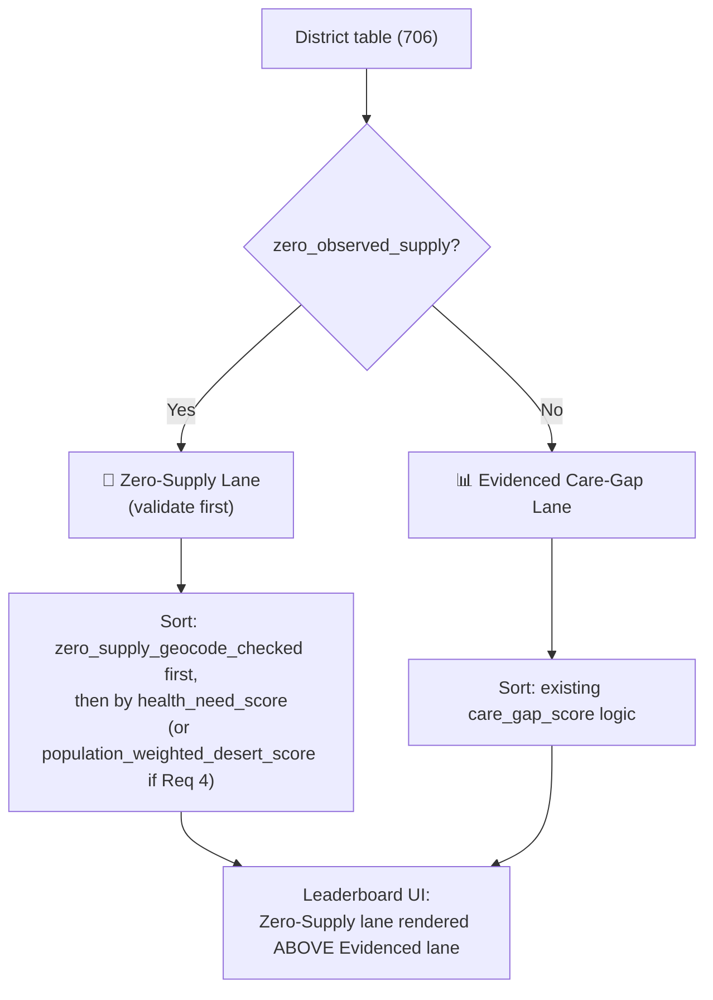

# Feature Spec: Zero-Supply Desert Recovery & Geocoding Enrichment

_Status: Draft_
_Last updated: 2026-06-15_
_Related: `DECISION_LOG.md` (§3 join strategy, §7 geo validation)_

---

## 1. Problem Statement

The current pipeline builds the district-level analysis (`district_health_facility_cleaned.csv`) by aggregating **only facility rows that successfully joined to an NFHS district**. As a result:

- NFHS has **706 districts**, but the output contains only **494 districts**.
- The **~212 NFHS districts with zero matched facilities are silently dropped.**

This is a critical analytical gap. From a medical-desert perspective, a district with **zero observed facility supply is the strongest possible desert signal** — it potentially means residents have no access to any clinical facility. By dropping these rows, the pipeline introduces **survivorship bias**: only districts that the FDR crawl happened to cover are analyzed, and the very districts most likely to be real deserts are excluded from the leaderboard.

A district can have zero matched facilities for three reasons, which the current pipeline cannot distinguish:

1. **Real desert** — no facilities exist or operate in the district.
2. **Crawl gap** — facilities exist but the FDR web crawl never found them.
3. **Join failure** — facilities were crawled but could not be mapped to the district due to PIN/name mismatches (these become `pincode_only_no_health_match`, `no_valid_pincode`, or `unjoined`).

This feature surfaces zero-supply districts, ranks them as the highest planning priority, and uses geocoding as an indirect validation mechanism to separate real deserts (case 1) from join failures (case 3).

---

## 2. Goals

1. **Include all 706 NFHS districts** in the district-level output, annotating zero-supply districts explicitly rather than dropping them.
2. **Rank zero-supply districts as highest priority** in the planning taxonomy, with an uncertainty posture that communicates the three possible explanations.
3. **Geocode the unmatched facility rows** (failed exact / fuzzy / city-fallback joins) to recover district assignments, which either:
   - fills a zero-supply district (reducing the false-desert risk), or
   - confirms the district remains empty (strengthening the real-desert signal).
4. **(Optional)** Extend geocoding to all unmatched/ambiguous rows, not just the high-priority geo-suspect list.
5. **(Optional)** Weight zero-supply deserts by affected population using WorldPop India.

### Non-Goals

- No human verification of facilities (consistent with the existing no-human-label posture).
- No change to the existing trust/uncertainty scoring of matched facilities.
- No new authoritative registry integration (HFR/PM-JAY) — that remains a future phase.
- No claim of measured accuracy; all new outputs carry uncertainty bands and reason codes.

---

## 3. Background / Current Behavior

Relevant code: `scripts/build_hackathon_dataset.py`

```python
# build_district_dataset() — line ~1195
joined = clean[clean["state_ut"].notna() & clean["district_name"].notna()].copy()
# ... aggregation grouped by (state_ut, district_name) ...
district = health_first.merge(metrics, on=["state_ut", "district_name"], how="left", validate="1:1")
```

`health_first` is derived from `joined` (matched facilities only), so NFHS districts with no matched facilities never enter the district table.

The unmatched facility rows already exist and are tracked:

| Join strategy | Rows | Meaning |
|---|---|---|
| `pincode_only_no_health_match` | 397 | PIN matched India Post, but district/state not found in NFHS |
| `no_valid_pincode` | 150 | No parseable 6-digit PIN |
| `unjoined` | 66 | No usable geography at all |

Total recoverable candidates: **~613 facility rows.**

The geocoding pipeline (`scripts/run_google_geocoding_validation.py`) currently exists only for **coordinate correction** of geo-suspect rows that already have a district assignment. It is not wired to perform **district recovery** from `address_components`.

---

## 4. Requirements

### Requirement 1: Include zero-supply NFHS districts (HIGHEST PRIORITY)

**User story:** As a volunteer clinician, I want to see districts that have health need data but zero observed facility supply, so that I can identify the most likely real medical deserts.

#### Acceptance Criteria

1. WHEN the district dataset is built, THE pipeline SHALL include one row for every NFHS district (target: all 706), not only districts with matched facilities.
2. WHERE a district has zero matched facility rows, THE pipeline SHALL set `observed_facility_rows = 0` and all facility-derived metric columns to `0` or `NULL` (not drop the row).
3. WHERE a district has zero matched facility rows, THE pipeline SHALL set `planning_category = "zero_observed_supply_unvalidated"` (a new category) instead of omitting the district.
4. THE pipeline SHALL retain the full NFHS health-need indicators and `health_need_score` for every district, including zero-supply districts.
5. THE pipeline SHALL set `district_uncertainty_level = "higher"` for zero-supply districts, because absence of supply has three competing explanations (real desert / crawl gap / join failure).
6. THE pipeline SHALL add a boolean `zero_observed_supply` column to the district table for downstream filtering.
7. THE district leaderboard SHALL present zero-supply districts in a **separate lane** ranked above the evidenced care-gap lane, NOT interleaved by `health_need_score` (see §5.5).
8. THE audit (`cleaned_dataset_audit.json`) SHALL report the count of zero-supply districts and the new total district count.

#### New planning categories

Zero-supply districts have three terminal states reflecting how much geocoding evidence was gathered (see Requirement 2):

| Category | Meaning | Desert confidence | Doctor-facing action |
|---|---|---|---|
| `zero_observed_supply_unvalidated` | High need, zero observed supply, no geocoding evidence either way | Lowest — blind spot | Validate supply absence first |
| `zero_supply_geocode_checked` | Geocoding attempted on nearby unmatched rows; none confirmed | **Higher** — actively checked | Strong deploy candidate; verify on the ground |

Both sit **above** `real_desert_candidate` in priority because they represent complete observed absence rather than low-but-nonzero supply. `zero_supply_geocode_checked` ranks above `zero_observed_supply_unvalidated` because the desert signal has been actively hardened.

---

### Requirement 2: Geocode zero-supply / unmatched rows for district recovery (HIGHEST PRIORITY)

**User story:** As a data engineer, I want to geocode the facility rows that failed to join, so that I can recover their true district and distinguish real deserts from join failures.

#### Acceptance Criteria

1. WHEN a facility row has `join_strategy IN ("pincode_only_no_health_match", "no_valid_pincode", "unjoined")`, THE pipeline SHALL include it in a district-recovery geocoding batch.
2. THE district-recovery step SHALL run the existing LLM address janitor to produce a `geocoder_query` from the raw address fields.
3. THE district-recovery step SHALL call the geocoder with `components=country:IN` and parse `address_components` to extract `administrative_area_level_2` (district) and `administrative_area_level_1` (state).
4. THE pipeline SHALL normalize the geocoder-returned district/state using the existing `normalize_state` / `normalize_district` functions and re-attempt the NFHS join.
5. WHERE the geocoder-recovered district matches an NFHS district, THE pipeline SHALL assign `join_strategy = "geocoder_district_recovery"` with `join_confidence` derived from `location_type`:
   - `ROOFTOP` / `RANGE_INTERPOLATED` → 0.70
   - `GEOMETRIC_CENTER` → 0.60
   - `APPROXIMATE` → 0.50
6. THE pipeline SHALL apply a **two-tier acceptance rule** when deciding whether a recovery counts as observed supply (asymmetric-harm conservative — never silently erase a desert):
   - `ROOFTOP` / `RANGE_INTERPOLATED` (≥0.70) → counts as recovered supply; district leaves the zero-supply state.
   - `GEOMETRIC_CENTER` (0.60) → counts as **tentative** supply; district is marked `supply_recovered_low_confidence` and stays visually flagged.
   - `APPROXIMATE` (≤0.50) → does **NOT** count as supply; district stays in a zero-supply state, but the attempted recovery is recorded for the review queue.
7. WHERE the geocoder recovers a district (≥0.70) that was previously zero-supply, THE pipeline SHALL move that district out of the zero-supply state and record the recovery in an audit field.
8. WHERE geocoding was attempted for a zero-supply district but no recovery met the acceptance threshold, THE pipeline SHALL set that district's category to `zero_supply_geocode_checked` (a stronger desert signal than unvalidated).
9. WHERE geocoding fails (`ZERO_RESULTS`) or the recovered district still does not match NFHS, THE pipeline SHALL keep the facility unmatched and record `geocoder_recovery_outcome = "unresolved"`.
10. THE pipeline SHALL persist geocoder response metadata (`status`, `formatted_address`, `place_id`, `location_type`, `partial_match`) for every recovery attempt, for explainability.
11. THE pipeline SHALL treat geocoding as an uncertainty reducer, NOT a truth oracle: a recovered district narrows uncertainty only when the geocoder admin geography is internally consistent (state + district agree).
12. THE district-recovery outcomes SHALL be summarized: how many zero-supply districts were filled, how many remained empty after checking (signal hardened to `zero_supply_geocode_checked`), and how many facilities remained unresolved.

#### Recovery outcome taxonomy

| `geocoder_recovery_outcome` | Meaning | Effect on desert signal |
|---|---|---|
| `district_recovered` | Geocoder resolved to a valid NFHS district at ≥0.70 confidence | Fills supply; reduces false-desert risk |
| `district_recovered_tentative` | Geocoder resolved at GEOMETRIC_CENTER (0.60) | Tentative supply; district flagged `supply_recovered_low_confidence` |
| `confirmed_empty` | Geocoder attempted but no recovery met threshold; district still has no supply | Strengthens real-desert signal → `zero_supply_geocode_checked` |
| `unresolved` | Geocoder failed or admin geography inconsistent | District stays unvalidated |
| `not_attempted` | No facility row pointed at this district | District stays `zero_observed_supply_unvalidated` |

---

### Requirement 3 (OPTIONAL): Extend geocoding beyond the high-priority list

**User story:** As a data engineer, I want geocoding applied to all rows where it could help, so that coverage is maximized rather than capped at a priority subset.

#### Acceptance Criteria

1. WHERE the `--full-coverage` flag is set, THE pipeline SHALL geocode ALL rows matching the recovery criteria (not just the top-N priority list).
2. THE pipeline SHALL retain the existing priority-ranked batch as the default behavior when the flag is absent (cost control).
3. THE pipeline SHALL report the incremental district recoveries and API call count attributable to full-coverage mode.
4. WHERE full-coverage mode is used, THE pipeline SHALL deduplicate geocoder queries (identical normalized addresses share one API call) to control cost.

---

### Requirement 4 (OPTIONAL): Population-weight zero-supply deserts via WorldPop

**User story:** As a planner, I want zero-supply deserts weighted by the population affected, so that I can prioritize a desert serving 2 million people over one serving 50,000 at the same need score.

#### Acceptance Criteria

1. WHERE WorldPop India raster data and district boundary polygons (geoBoundaries) are available, THE pipeline SHALL compute an estimated population per district via zonal statistics.
2. THE pipeline SHALL add a `district_population_estimate` column and a `population_weighted_desert_score` that combines `health_need_score` with population for zero-supply districts.
3. THE leaderboard SHALL offer an optional sort by `population_weighted_desert_score` within the zero-supply lane.
4. THE pipeline SHALL clearly label population figures as estimates derived from raster aggregation, not census counts.

> **Scope note:** This is a fast-follow / Phase-2 enhancement. It introduces geospatial dependencies (raster processing, boundary polygons, zonal statistics) with a different dependency footprint from the core zero-supply work. The core feature (Requirements 1–2) must ship and demo independently of this requirement.

---

## 5. Design

### 5.1 Data flow changes



### 5.2 Key implementation changes

**`build_district_dataset()` — flip the join direction:**

Currently the district table is built from the facility side (matched facilities only). Change it to build from the **NFHS side** so every district appears:

```python
# Build metrics from matched facilities (unchanged)
metrics = grouped.agg(...).reset_index()

# NEW: start from the full NFHS district list, LEFT JOIN metrics onto it
all_districts = health[["state_ut", "district_name", "health_need_score", *health_cols]].copy()
district = all_districts.merge(metrics, on=["state_ut", "district_name"], how="left")

# Zero-supply districts have NaN metrics after the left join
district["observed_facility_rows"] = district["observed_facility_rows"].fillna(0).astype(int)
district["zero_observed_supply"] = district["observed_facility_rows"].eq(0)
```

**Planning category — add the zero-supply branches (highest priority):**

```python
district["planning_category"] = np.select(
    [
        district["zero_supply_geocode_checked_flag"],   # NEW — checked & still empty (highest)
        district["zero_observed_supply"],               # NEW — unvalidated zero supply
        # ... existing real_desert / phantom / supply_quality / referral conditions ...
    ],
    [
        "zero_supply_geocode_checked",                  # NEW
        "zero_observed_supply_unvalidated",             # NEW
        # ... existing labels ...
    ],
    default="mixed_or_monitor",
)
district["district_uncertainty_level"] = np.where(
    district["zero_observed_supply"], "higher", district["district_uncertainty_level"]
)
```

**District-recovery geocoding — new function:**

A new function (e.g., `recover_districts_via_geocoder()`) that:
1. Selects rows with failed-join strategies.
2. Reuses the LLM janitor + geocoder path from `run_google_geocoding_validation.py`.
3. Parses `address_components` for district/state (new logic — the current script only stores coordinates).
4. Normalizes and re-joins to NFHS.
5. Updates `join_strategy`, `join_confidence`, and `geocoder_recovery_outcome` on recovered rows.
6. Feeds recovered rows back into `build_district_dataset()` before aggregation.

### 5.3 New / changed columns

**Facility table (`facility_health_cleaned.csv`):**
| Column | Type | Meaning |
|---|---|---|
| `geocoder_recovery_outcome` | string | `district_recovered` / `confirmed_empty` / `unresolved` / `not_attempted` |
| `geocoder_recovered_district` | string | District extracted from geocoder `address_components` |
| `geocoder_recovered_state` | string | State extracted from geocoder `address_components` |
| `geocoder_location_type` | string | `ROOFTOP` / `RANGE_INTERPOLATED` / `GEOMETRIC_CENTER` / `APPROXIMATE` |
| `join_strategy` | string | Add new value `geocoder_district_recovery` |

**District table (`district_health_facility_cleaned.csv`):**
| Column | Type | Meaning |
|---|---|---|
| `zero_observed_supply` | bool | True when no facilities matched this district |
| `planning_category` | string | Add new values `zero_observed_supply_unvalidated`, `zero_supply_geocode_checked` |
| `supply_recovered_by_geocoding` | bool | True when geocoding moved this district out of zero-supply (≥0.70) |
| `supply_recovered_low_confidence` | bool | True when only a GEOMETRIC_CENTER (0.60) recovery exists; tentative supply |
| `district_population_estimate` | float | _(Req 4, optional)_ WorldPop-derived population estimate |
| `population_weighted_desert_score` | float | _(Req 4, optional)_ Need × population for zero-supply districts |

### 5.5 Leaderboard lane design (Requirement 1, criterion 7)

The leaderboard uses **two separate lanes** rather than one interleaved ranking, because zero-supply and evidenced rows have a different epistemic status and are not comparable on a single need axis.



Within the zero-supply lane, ordering is:
1. `zero_supply_geocode_checked` rows (hardened desert signal) before `zero_observed_supply_unvalidated` (blind spots).
2. Then by `health_need_score` descending (or `population_weighted_desert_score` if Requirement 4 is implemented).

### 5.4 Audit additions (`cleaned_dataset_audit.json`)

```json
{
  "total_nfhs_districts": 706,
  "districts_in_output": 706,
  "zero_observed_supply_districts": <count>,
  "zero_supply_geocode_checked_districts": <count>,
  "districts_recovered_by_geocoding": <count>,
  "districts_recovered_low_confidence": <count>,
  "facility_rows_geocoded_for_recovery": <count>,
  "facility_rows_district_recovered": <count>,
  "facility_rows_unresolved": <count>
}
```

---

## 6. Validation & Verification

1. **Count invariant:** `districts_in_output == total_nfhs_districts` (706).
2. **No false drops:** every district present before the change is still present.
3. **Zero-supply correctness:** every row with `observed_facility_rows == 0` has `zero_observed_supply == True` and a category of either `zero_observed_supply_unvalidated` or `zero_supply_geocode_checked`.
4. **Recovery monotonicity:** a district recovered by geocoding at ≥0.70 must have `observed_facility_rows > 0` and `supply_recovered_by_geocoding == True`; a 0.60 recovery sets `supply_recovered_low_confidence == True` but keeps the zero-supply flag visible.
5. **Conservative acceptance:** no `APPROXIMATE` (≤0.50) recovery may move a district out of a zero-supply state.
6. **Geocoder honesty:** no recovered row may be labeled `passed_checks`/`verified`; recovery only changes the district assignment and confidence band.
7. **Cost guard:** in default mode, geocoder calls ≤ configured `--limit`; full-coverage mode reports total calls and dedup savings.
8. **Lane separation:** the leaderboard renders zero-supply districts in a distinct lane above the evidenced care-gap lane; the two are never merged into one ranking.
9. **Sensitivity check:** confirm `zero_supply_geocode_checked` rows rank above `zero_observed_supply_unvalidated` within the zero-supply lane.

---

## 7. Risks & Mitigations

| Risk | Mitigation |
|---|---|
| Geocoder `administrative_area_level_2` doesn't map cleanly to NFHS district names | Reuse existing `DISTRICT_ALIASES` crosswalk + fuzzy matching (≥0.92 threshold) on recovered names |
| `no_valid_pincode` rows may have addresses too garbled to geocode | Accept `unresolved` outcome; do not force a match; keep district as unvalidated |
| Including 706 districts inflates the leaderboard with low-confidence rows | `district_uncertainty_level = higher` + explicit `zero_observed_supply_unvalidated` category make the uncertainty visible |
| Full-coverage geocoding cost | Default to priority batch; dedup identical queries; flag-gated full coverage |
| Treating a recovered geocode as facility truth | Recovery only assigns district + confidence band; trust posture and citations unchanged |
| Zero-supply could be a crawl gap, not a real desert | The 3-way `geocoder_recovery_outcome` taxonomy + `higher` uncertainty communicate this explicitly; never claim "confirmed desert" |

---

## 8. Rollout / Task Outline

1. Refactor `build_district_dataset()` to build from the NFHS side (all 706 districts) with zero-supply annotation.
2. Add the `zero_observed_supply_unvalidated` and `zero_supply_geocode_checked` planning categories and the `higher` uncertainty override.
3. Update the leaderboard in `app/lib/data.py` to render two separate lanes (zero-supply above evidenced), with the within-lane ordering from §5.5.
4. Implement `recover_districts_via_geocoder()`: extract + normalize `address_components`, re-join to NFHS, apply the two-tier acceptance rule.
5. Wire recovered rows back into the district aggregation and set the recovery flags.
6. Add `--full-coverage` flag and query deduplication (optional Requirement 3).
7. Extend `cleaned_dataset_audit.json` with the new counts and validation invariants.
8. Update `DECISION_LOG.md` §3/§4 to document the new join strategy and district grain decision.
9. Add UI affordances (lane header, category chips, uncertainty badge) for the new categories in `app/lib/ui.py`.
10. _(Optional, Phase 2)_ Implement WorldPop population weighting (Requirement 4).

---

## 9. Resolved Design Decisions

| # | Decision | Resolution |
|---|---|---|
| 1 | Leaderboard layout | **Separate lane.** Zero-supply districts render in a distinct lane above the evidenced care-gap lane (§5.5). The two are never interleaved, because they have different epistemic status. |
| 2 | Geocoder confidence floor for "supply" | **Two-tier conservative.** ROOFTOP/RANGE_INTERPOLATED (≥0.70) counts as supply; GEOMETRIC_CENTER (0.60) is tentative and stays flagged; APPROXIMATE (≤0.50) never moves a district out of zero-supply. Rationale: falsely erasing a desert is higher-harm than falsely keeping one. |
| 3 | Distinct category for checked-but-empty | **Yes.** `zero_supply_geocode_checked` is a separate, higher-confidence desert signal than `zero_observed_supply_unvalidated` (blind spot). Geocoding either fills a gap or hardens the desert signal. |
| 4 | WorldPop population weighting | **Optional (Requirement 4 / Phase 2).** Strong enhancement but a different geospatial dependency footprint; the core feature ships independently. |
